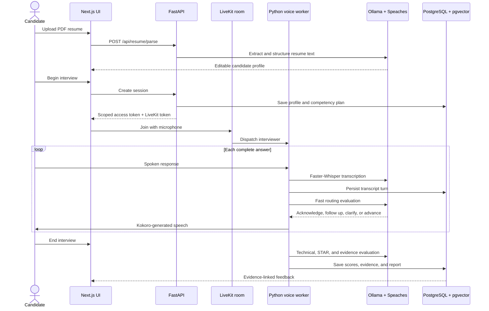
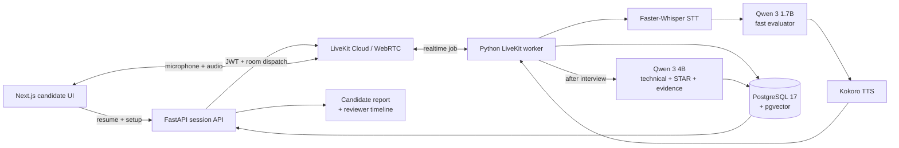

<div align="center">

# ARIES

### Resume-aware AI voice interviews with evidence-linked feedback

ARIES turns a PDF resume and target role into a real-time spoken interview, follows up on what the candidate actually says, and produces a report whose feedback is linked to exact transcript evidence.

[](https://www.python.org/)
[](https://nextjs.org/)
[](https://fastapi.tiangolo.com/)
[](https://livekit.io/)
[](https://ollama.com/)
[](https://www.postgresql.org/)

[Features](#what-aries-does) · [Workflow](#how-an-interview-works) · [Architecture](#architecture) · [Quick start](#quick-start) · [API](#api-surface) · [Limitations](#current-limitations)

</div>

---

## Why ARIES exists

Many mock-interview tools are text forms with a microphone attached. They ask generic questions, split an answer whenever the speaker pauses, lose conversational context, and finish with feedback that cannot explain where its conclusions came from.

ARIES was built around a different idea:

> A useful AI interviewer should understand the candidate's background, listen to a complete answer, respond naturally, and justify every assessment with evidence.

The result is a local-first interview system that separates fast conversational decisions from slower, deeper evaluation. The candidate gets a responsive voice experience during the interview and a more thorough report after it.

## What ARIES does

| Capability | What it means in practice |
|---|---|
| **PDF resume intake** | Extracts readable text from a resume and pre-fills the candidate's name, likely role, summary, skills, experience, and education. |
| **Editable candidate profile** | Every extracted field can be reviewed or corrected before the interview begins. |
| **Real-time voice interview** | LiveKit carries browser audio while Faster-Whisper transcribes and Kokoro speaks the interviewer's response. |
| **Complete-answer capture** | Natural pauses do not create separate answers; the candidate explicitly commits a finished response. |
| **Two-way conversation** | The candidate can ask for repetition or clarification, say they do not know, interrupt, and receive a context-appropriate response. |
| **Grounded follow-ups** | A compact local evaluator decides whether to probe, clarify, advance, or conclude based on the current answer. |
| **Deep post-interview evaluation** | Separate evaluators assess answer depth, technical substance, and STAR structure without increasing voice latency. |
| **Evidence-linked reporting** | Feedback points to exact, substring-verified excerpts from the saved transcript. |
| **Delivery mechanics** | Measures pace, filler words, and pauses without inferring confidence, honesty, personality, or employability. |
| **Candidate and reviewer views** | Provides a candidate report plus a session-scoped reviewer timeline and replay view. |

## How an interview works



### The candidate journey

1. Upload a text-based PDF resume, up to 5 MB and 15 pages.
2. Review the automatically extracted profile and choose a target role.
3. Join a private LiveKit room from `localhost` and allow microphone access.
4. Answer naturally, including pauses, then select **Finish answer** once the response is complete.
5. Receive acknowledgements and selective follow-up questions during the conversation.
6. End the interview and wait while deeper evaluation finishes in the background.
7. Review rubric scores, strengths, improvements, practice actions, delivery mechanics, evidence excerpts, and the complete transcript.

## Architecture



### Why two evaluation speeds?

Running every evaluator before asking the next question would make the interview feel slow. ARIES therefore uses two paths:

| Path | Model and responsibility | Timing |
|---|---|---|
| **Conversational path** | Qwen 3 1.7B scores relevance and depth, writes a short acknowledgement, and decides whether to probe, clarify, advance, or wrap up. | Runs after each committed answer. |
| **Deep evaluation path** | Qwen 3 4B evaluates technical depth, STAR structure where applicable, and exact supporting evidence. | Runs after the voice session ends. |

The final narrative is assembled deterministically from persisted evaluator details. This prevents the report writer from inventing unrelated strengths or improvement advice.

### Evaluation and evidence model

Every meaningful candidate answer can produce:

- an `answer_depth` score from the fast evaluator;
- a `technical_depth` score with strengths and missing concepts;
- a `star_structure` score for behavioral answers;
- one or more verbatim evidence excerpts;
- evaluator metadata, including competency, rationale, action, and measured latency;
- delivery measurements derived separately from synchronized transcript and microphone timing.

Evidence is accepted only when the quoted text is an exact contiguous substring of the candidate's stored answer. The report then selects a concise evidence excerpt for each evaluated answer.

## Technology stack

| Layer | Technology | Responsibility |
|---|---|---|
| **Web application** | Next.js 15, React 19, TypeScript | Setup form, resume upload, interview room, live transcript, report, and reviewer pages. |
| **Backend API** | FastAPI, Pydantic, Uvicorn | Resume parsing, session creation, scoped access tokens, transcript replay, review, and reporting endpoints. |
| **Realtime media** | LiveKit Cloud, WebRTC | Low-latency browser audio, room lifecycle, agent dispatch, and reliable data-channel events. |
| **Voice worker** | LiveKit Agents, Silero VAD | Interview lifecycle, interruption handling, manual answer commits, transcript capture, and TTS playback. |
| **Speech-to-text** | Speaches, Faster-Whisper Small English | Local transcription of candidate audio. |
| **Text-to-speech** | Speaches, Kokoro 82M ONNX | Local generation of the interviewer's voice. |
| **Language models** | Ollama, Qwen 3 1.7B and 4B | Conversational routing, resume structuring, technical evaluation, STAR scoring, and evidence extraction. |
| **Embeddings** | Ollama, Nomic Embed Text | Local 768-dimensional embeddings for question retrieval. |
| **Orchestration** | LangGraph | Inspectable adaptive decision graph for non-guided interview sessions. |
| **Persistence** | PostgreSQL 17, SQLAlchemy, asyncpg, pgvector | Sessions, competency plans, turns, scores, evidence, reports, and question vectors. |
| **Infrastructure** | Docker Compose, PowerShell | PostgreSQL, Speaches, model setup, schema initialization, and local development. |
| **Observability** | OpenTelemetry, optional Langfuse | Tracing for API, agent, evaluation, and latency diagnostics. |

## Data and privacy boundaries

ARIES is local-first, but not completely offline:

- Resume PDF bytes are parsed in memory and are not written to disk by the upload endpoint.
- Extracted resume text may be persisted in the candidate's local PostgreSQL session record.
- Ollama, Faster-Whisper, Kokoro, embeddings, and evaluation run on the local machine.
- Live audio travels through the configured LiveKit Cloud project for real-time room transport.
- The browser never receives the LiveKit API secret; FastAPI mints a short-lived room JWT.
- Transcript, report, and reviewer endpoints require an HMAC-signed token scoped to one session.
- Filled `.env` files are excluded by `.gitignore` and must never be committed.
- Delivery mechanics are descriptive measurements only, not personality or hiring predictions.

## Repository layout

```text
aries-voice/
├── backend/
│   ├── agent/          # LiveKit worker, interviewer, turn lifecycle
│   ├── api/            # FastAPI routes and session security
│   ├── db/             # schema, async sessions, persistence helpers
│   ├── evaluation/     # fast, technical, STAR, evidence, report, prosody
│   ├── graph/          # LangGraph routing policy
│   ├── integrity/      # observation-only delivery/integrity signals
│   ├── resume/         # bounded in-memory PDF extraction and profiling
│   ├── retrieval/      # competency planning and pgvector retrieval
│   └── tests/          # unit and policy tests
├── frontend/
│   ├── app/            # setup, interview, report, and review routes
│   ├── components/     # LiveKit controls, transcript, report UI
│   └── lib/            # typed API and session client
├── scripts/            # local AI setup and model warm-up
├── docs/               # project brief and interview documentation
├── docker-compose.yml  # PostgreSQL + CUDA Speaches services
├── SETUP.md            # detailed manual setup guide
└── README.md
```

## Quick start

The current development workflow is designed for Windows and PowerShell.

### Prerequisites

- Python 3.11 or newer
- Node.js 20 or newer
- Docker Desktop
- Ollama
- An NVIDIA GPU supported by Docker Desktop/WSL2 for the current CUDA Speaches configuration
- A LiveKit Cloud project and its URL, API key, and API secret

### 1. Clone and configure

```powershell
git clone https://github.com/madhavsk-programs/aries-job-interview.git
cd aries-job-interview

Copy-Item backend\.env.example backend\.env
Copy-Item frontend\.env.local.example frontend\.env.local
```

Edit `backend/.env` and set at least:

```dotenv
LIVEKIT_URL=wss://your-project.livekit.cloud
LIVEKIT_API_KEY=your-key
LIVEKIT_API_SECRET=your-secret
SESSION_SIGNING_SECRET=replace-with-a-long-random-value
```

Never place server credentials in `frontend/.env.local` or in a variable whose name begins with `NEXT_PUBLIC_`.

### 2. Install application dependencies

```powershell
cd backend
python -m venv .venv
.\.venv\Scripts\python.exe -m pip install -r requirements.txt

cd ..\frontend
npm install
cd ..
```

Using the virtual environment's Python executable directly avoids PowerShell activation-policy problems.

### 3. Start local infrastructure and download models

Start Docker Desktop, then run:

```powershell
ollama pull qwen3:1.7b
.\scripts\setup-local-ai.ps1
```

The setup script starts PostgreSQL and Speaches, starts Ollama when needed, downloads the main Qwen, embedding, STT, and TTS models, warms the language model, creates the database schema, and refreshes the local question index.

### 4. Run the application

Keep all three terminals running.

**Terminal 1 — FastAPI**

```powershell
cd "C:\path\to\aries-job-interview\backend"
.\.venv\Scripts\python.exe -m uvicorn api.main:app --reload --port 8000
```

**Terminal 2 — realtime voice worker**

```powershell
cd "C:\path\to\aries-job-interview\backend"
.\.venv\Scripts\python.exe -m agent.worker dev
```

Wait until this terminal prints `registered worker`. Without the worker, the browser can enter a room but no interviewer will join or ask the opening question.

**Terminal 3 — Next.js**

```powershell
cd "C:\path\to\aries-job-interview\frontend"
npm run dev
```

Open <http://localhost:3000>. Use `localhost`, not a LAN IP, because browser microphone access requires a secure context and treats `localhost` as secure.

For the complete setup guide, model details, environment variables, and acceptance checks, see **[SETUP.md](SETUP.md)**.

## Health checks

```powershell
Invoke-RestMethod http://localhost:8000/health
Invoke-RestMethod http://localhost:8000/health/ai
```

`/health/ai` identifies missing Ollama or speech services and models. A new interview can only be created when this response reports `ready: true`.

## API surface

| Method | Endpoint | Purpose |
|---|---|---|
| `GET` | `/health` | API, persistence, and tracing status. |
| `GET` | `/health/ai` | Local Ollama and Speaches readiness. |
| `POST` | `/api/resume/parse` | Validate, extract, and structure a PDF resume. |
| `POST` | `/api/sessions` | Create a competency plan, LiveKit room token, and scoped report token. |
| `GET` | `/api/sessions/{id}/transcript` | Replay the persisted transcript. |
| `GET` | `/api/sessions/{id}/report` | Poll or retrieve the completed candidate report. |
| `POST` | `/api/sessions/{id}/report` | Rebuild a report from stored evaluation data. |
| `GET` | `/api/sessions/{id}/review` | Retrieve the reviewer timeline, scores, and delivery snapshot. |

Session endpoints require the access token returned when the session is created.

Interactive API documentation is available at <http://localhost:8000/docs> while FastAPI is running.

## Tests

Backend tests cover conversation intent, routing policy, evaluator guardrails, score normalization, evidence verification, resume parsing, session security, database lifecycle, guided follow-ups, and report construction.

```powershell
cd backend
.\.venv\Scripts\python.exe -m unittest discover -s tests -v
```

Frontend type-check:

```powershell
cd frontend
npx tsc --noEmit --incremental false
```

## Troubleshooting

| Symptom | Likely cause | What to check |
|---|---|---|
| Room connects but no question is asked | Voice worker is stopped or cannot reach LiveKit Cloud. | Start `python -m agent.worker dev` and wait for `registered worker`. |
| `Local AI is not ready` | Ollama, Speaches, or a required model is missing. | Open `/health/ai`, then rerun `scripts\setup-local-ai.ps1`. |
| `docker compose` cannot find a configuration file | Command was run outside the repository root. | Change directory to the folder containing `docker-compose.yml`. |
| Microphone is unavailable | The page is not running in a secure browser context. | Use `http://localhost:3000`, not a raw LAN IP. |
| An answer appears fragmented | The browser or worker is running an older build. | Restart the API and worker, refresh the page, and begin a new session. |
| Report remains pending | The room is still connected or deep evaluation is running. | End the interview, keep Ollama running, and allow the report page to poll. |
| Speech transcription contains incorrect technical terms | The local STT model misheard domain vocabulary. | Speak slightly slower; future work includes vocabulary-aware correction. |

## Design guardrails

- ARIES is an interview-practice system, not a hiring decision engine.
- The interviewer does not reveal internal action labels or scores during the conversation.
- Candidate requests for repetition or clarification are answered rather than scored as interview responses.
- Evidence excerpts must exist verbatim inside a stored candidate answer.
- Deep evaluation runs outside the conversational audio path.
- Database writes are designed to degrade gracefully so a persistence outage does not terminate the call.
- Integrity monitoring reports observations only; it never produces a cheating verdict.
- Delivery metrics never infer confidence, personality, honesty, trustworthiness, or protected traits.

## Current limitations

- The included Speaches container is configured for an NVIDIA CUDA GPU; a CPU compose profile is not included yet.
- Speech-to-text errors can affect downstream evaluation even though evaluators are instructed not to penalize likely transcription mistakes.
- The default candidate flow uses a guided software-development interview with selective follow-ups; a broader adaptive planning mode exists at the API level but is not exposed as a public UI option.
- The project is designed for local development and demonstration, not production multi-tenancy.
- There is no account system, hosted deployment, or long-term user dashboard.
- Scanned-image and password-protected resumes are not supported.

## Roadmap

- [ ] Vocabulary-aware correction for technical speech transcripts
- [ ] CPU-compatible speech-service profile
- [ ] Job-description-to-resume gap analysis
- [ ] Configurable interview roles and competency templates in the UI
- [ ] Evaluation calibration against a human-scored benchmark set
- [ ] Downloadable PDF reports and shareable read-only links
- [ ] Resumable sessions and worker-reconnection handling
- [ ] Production authentication, rate limiting, and deployment configuration

## Author

Built by **Madhav Khurana** as a local-first exploration of real-time voice agents, evidence-grounded evaluation, and reliable AI product engineering.

[GitHub profile](https://github.com/madhavsk-programs)

---

<div align="center">

**ARIES does not try to replace an interviewer. It helps candidates practise with feedback they can inspect.**

</div>
